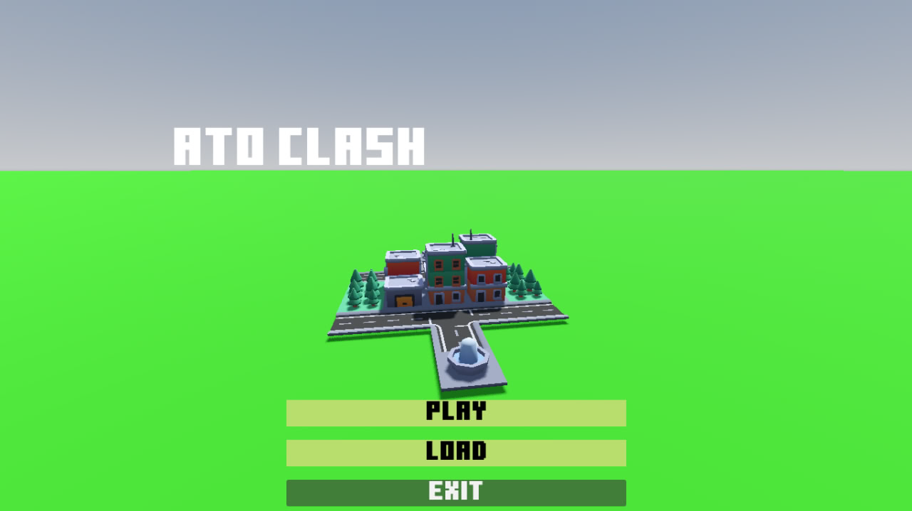

# Ato Clash

Welcome to **Ato Clash**, a strategy game inspired by Clash of Clans, developed using Godot 4.2. This project is currently in development. Stay tuned for updates!



## Table of Contents

- [About the Project](#about-the-project)
- [Features](#features)
- [Installation](#installation)
- [Usage](#usage)
- [Roadmap](#roadmap)
- [Contributing](#contributing)
- [License](#license)
- [Contact](#contact)

## About the Project

Ato Clash is a strategy game where players build their own village, train troops, and battle against other players. The goal is to create the most powerful village and climb to the top of the leaderboards.

## Features

- **Village Building**: Construct and upgrade buildings to strengthen your village.
- **Resource Management**: Gather resources to fund your village’s growth.
- **Troop Training**: Train various types of troops for attacking enemy villages.
- **Strategic Battles**: Plan and execute attacks on other players’ villages.

## Installation

To get a local copy up and running follow these simple steps:

1. **Clone the repository**
   ```sh
   git clone https://github.com/Alazar42/AtoClash.git
   ```
2. **Open with Godot**
   - Open Godot 4.2 and import the project by selecting the `project.godot` file in the cloned directory.

## Usage

1. **Run the Project**
   - Open Godot and run the project by pressing the play button.

2. **Gameplay**
   - Start building your village and training your troops.
   - Attack other players to earn resources and climb the leaderboards.

## Roadmap

- [ ] Implement basic village building mechanics
- [ ] Add resource gathering system
- [ ] Develop troop training functionalities
- [ ] Create battle mechanics and AI
- [ ] Multiplayer integration
- [ ] User interface improvements
- [ ] Regular updates with new features and enhancements

## Contributing

Contributions are what make the open-source community such an amazing place to learn, inspire, and create. Any contributions you make are **greatly appreciated**.

1. **Fork the Project**
2. **Create your Feature Branch** (`git checkout -b feature/AmazingFeature`)
3. **Commit your Changes** (`git commit -m 'Add some AmazingFeature'`)
4. **Push to the Branch** (`git push origin feature/AmazingFeature`)
5. **Open a Pull Request**

## License

Distributed under the MIT License. See `LICENSE.txt` for more information.

## Contact

Your Name - [alazartesfaye42@gmail.com](mailto:alazartesfaye42@gmail.com)

Project Link: [https://github.com/Alazar42/AtoClash](https://github.com/Alazar42/AtoClash)
